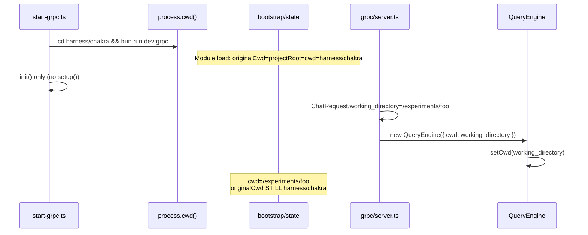

Your understanding is **correct**. The gRPC path sets **shell cwd** via `setCwd()` but does **not** establish the **permission/project root** the way CLI and Bridge do. Below is the full architecture map.

---

## Core model: three separate directory concepts

Chakra splits directory state into three bootstrap fields plus an async override:

| Symbol | Defined in | Stores |
|--------|------------|--------|
| `getOriginalCwd()` / `setOriginalCwd()` | `bootstrap/state.ts` | **Session permission root** + project identity for most “where is this project?” lookups |
| `getProjectRoot()` / `setProjectRoot()` | `bootstrap/state.ts` | **Stable project anchor** for skills/history/cron (does not follow mid-session worktree entry) |
| `getCwdState()` / `setCwdState()` | `bootstrap/state.ts` | **Mutable shell cwd** used by `pwd()` / `getCwd()` |
| `setCwd()` | `utils/Shell.ts` | Resolves path + calls `setCwdState()` (does **not** touch `originalCwd`) |
| `getCwd()` / `pwd()` | `utils/cwd.ts` | `AsyncLocalStorage` override → else `getCwdState()` |

Bootstrap initialization at module load:

```261:296:harness/chakra/src/bootstrap/state.ts
function getInitialState(): State {
  ...
  const rawCwd = cwd()
  ...
  resolvedCwd = realpathSync(rawCwd).normalize('NFC')
  ...
  const state: State = {
    originalCwd: resolvedCwd,
    projectRoot: resolvedCwd,
    ...
    cwd: resolvedCwd,
```

**Permission boundary** is **not** `getCwd()`. It is:

```668:675:harness/chakra/src/utils/permissions/filesystem.ts
export function allWorkingDirectories(
  context: ToolPermissionContext,
): Set<string> {
  return new Set([
    getOriginalCwd(),
    ...context.additionalWorkingDirectories.keys(),
  ])
}
```

---

## Per-symbol reference

### `getOriginalCwd` / `setOriginalCwd`

**Stores:** NFC-normalized permission root (`STATE.originalCwd`).

**Initialized:** `getInitialState()` → `process.cwd()` at first import of `bootstrap/state.ts`.

**Changes at:**
| Call site | When |
|-----------|------|
| `setup.ts` (worktree only) | `--worktree` startup after `process.chdir(worktreePath)` |
| `bridge/bridgeMain.ts` | Bridge startup (`runBridgeHeadless`, interactive bridge) |
| `main.tsx` | Session resume / SSH remote / user picks different directory |
| `EnterWorktreeTool` | Mid-session worktree entry |
| `ExitWorktreeTool` | Leaving worktree |
| `sessionRestore.ts` | Restoring worktree session state |

**Depends on it:**
- **Permission boundaries:** `allWorkingDirectories()`, `pathInAllowedWorkingPath()`, bash/file path validation
- **Project identity:** session storage, CLAUDE.md scope, plugins, settings resolution, hooks, `.claude/` paths
- **Bash cwd reset:** `resetCwdIfOutsideProject()` resets to `getOriginalCwd()`
- **NOT shell spawn cwd** (that uses `getCwd()` / `getCwdState()`)

---

### `getProjectRoot` / `setProjectRoot`

**Stores:** Stable project anchor (`STATE.projectRoot`).

**Initialized:** Same as `originalCwd` in `getInitialState()`.

**Changes at:** Only:
- `setup.ts` — `--worktree` flag (`setProjectRoot(getCwd())`)
- `ExitWorktreeTool` — restore after worktree

**Explicitly does NOT change** on `EnterWorktreeTool` (mid-session throwaway worktrees).

**Depends on it:** Skills, commands, agent memory, cron, history, memdir — “project identity” separate from mutable shell cwd.

---

### `getCwd` / `pwd` / `setCwd` / `setCwdState`

**`getCwdState()` / `setCwdState()`:** raw mutable cwd in bootstrap state.

**`setCwd(path)`:** resolves symlinks, updates `setCwdState()` only:

```447:464:harness/chakra/src/utils/Shell.ts
export function setCwd(path: string, relativeTo?: string): void {
  ...
  setCwdState(physicalPath)
```

**`getCwd()`:** `AsyncLocalStorage` override (concurrent agents) → else `getCwdState()`.

**Initialized:** `getInitialState().cwd`; then `setup()` / `QueryEngine` / worktree tools update via `setCwd`.

**Depends on it:**
- **Shell execution** (`Shell.ts` spawns with `pwd()`)
- **System prompt** (“Primary working directory: …”)
- **Relative path resolution** in file tools and bash path checks (cwd argument passed into validators)
- **NOT permission root** (that is `getOriginalCwd()`)

---

## Initialization flows by entrypoint

### 1. Interactive CLI (`main.tsx` → `setup.ts`)

```mermaid
sequenceDiagram
    participant User
    participant OS as process.cwd()
    participant State as bootstrap/state
    participant Setup as setup.ts
    participant Perm as permissionSetup.ts
    participant QE as QueryEngine

    User->>OS: cd /my/project && claude
    Note over State: Module load: originalCwd=projectRoot=cwd=OS
    OS->>Setup: setup(preSetupCwd)
    Setup->>Setup: setCwd(preSetupCwd)
    Note over State: cwd updated; originalCwd unchanged (same path)
    alt --worktree
        Setup->>OS: process.chdir(worktreePath)
        Setup->>Setup: setCwd(worktreePath)
        Setup->>State: setOriginalCwd(getCwd())
        Setup->>State: setProjectRoot(getCwd())
    end
    Note over Perm: setupPermissionContext(addDirs)
    Perm->>Perm: additionalWorkingDirectories += --add-dir
    QE->>Setup: setCwd(cwd) per query
```

Steps:
1. **Module load:** `originalCwd` = `projectRoot` = `cwd` = realpath(`process.cwd()`).
2. **`setup(cwd)`:** `setCwd(cwd)` — aligns shell cwd; hooks loaded from that dir.
3. **`--worktree` only:** `process.chdir`, then `setOriginalCwd` + `setProjectRoot`.
4. **`permissionSetup`:** `--add-dir` → `toolPermissionContext.additionalWorkingDirectories`.
5. **Each query:** `QueryEngine` receives `cwd` (from `getCwd()` / `process.cwd()` in print path) and calls `setCwd(cwd)`.

For a normal session started in the project directory, **`originalCwd` and shell cwd stay aligned** without ever calling `setOriginalCwd` again.

---

### 2. Bridge (`bridge/bridgeMain.ts`)

Bridge **explicitly** sets bootstrap state before any agent work:

```2078:2082:harness/chakra/src/bridge/bridgeMain.ts
  const { setOriginalCwd, setCwdState } = await import('../bootstrap/state.js')
  setOriginalCwd(dir)
  setCwdState(dir)
```

Headless worker does the same plus `process.chdir(dir)`:

```2816:2822:harness/chakra/src/bridge/bridgeMain.ts
  process.chdir(dir)
  const { setOriginalCwd, setCwdState } = await import('../bootstrap/state.js')
  setOriginalCwd(dir)
  setCwdState(dir)
```

Bridge treats `dir` as **trust boundary + permission root + shell cwd** (unified).

---

### 3. gRPC server (`grpc/server.ts` + `start-grpc.ts`)



gRPC path today:

```88:90:harness/chakra/src/grpc/server.ts
          engine = new QueryEngine({
            cwd: req.working_directory || process.cwd(),
```

```239:240:harness/chakra/src/QueryEngine.ts
    setCwd(cwd)
```

**Missing vs CLI/Bridge:**
| Step | CLI/Bridge | gRPC |
|------|------------|------|
| `setup()` | Yes | No |
| `setOriginalCwd(target)` | Yes (implicit or explicit) | **No** |
| `setProjectRoot(target)` | Yes (worktree) | **No** |
| `process.chdir(target)` | Bridge yes; CLI sometimes | **No** |
| `permissionSetup` / `--add-dir` | Yes | **No** (`getDefaultAppState()`) |
| Trust dialog | Yes | Skipped |

Proto comment frames `working_directory` as execution location:

```28:31:harness/chakra/src/proto/chakra.proto
message ChatRequest {
  string message = 1;
  string working_directory = 2; // Where the agent should execute commands
```

But the **permission system** was designed around **`getOriginalCwd()`**, not `QueryEngine.cwd`. The gRPC server is a thin wrapper that never bridges that gap.

---

## Is `ChatRequest.working_directory` shell-only or project root?

**Intended design (inferred):**

| Layer | Intended meaning |
|-------|------------------|
| **Proto field** | “Where the agent should execute commands” → shell cwd |
| **CLI/Bridge reality** | Unified workspace: same path is permission root, project identity, and shell cwd |
| **Permission engine** | Uses `getOriginalCwd()` + `additionalWorkingDirectories`, **not** `QueryEngine.cwd` |

So: the proto documents **shell cwd**, but **containment** only works when that path is also **`originalCwd`** (as in CLI when you `cd` into the project before launching). gRPC does not promote `working_directory` to `originalCwd`, so the field is **incomplete for confinement** as implemented.

`QueryEngine` does pass `additionalWorkingDirectories` into the system prompt, but gRPC never populates them from `working_directory`:

```296:298:harness/chakra/src/QueryEngine.ts
      additionalWorkingDirectories: Array.from(
        initialAppState.toolPermissionContext.additionalWorkingDirectories.keys(),
      ),
```

---

## Why repos escape the intended directory

1. **`getOriginalCwd()` = server startup dir** (`harness/chakra`), not client `working_directory`.
2. **Shell runs in** `experiments/foo` (`setCwd`), but **permissions check against** `harness/chakra`.
3. **Outside-dir operations → `ask`**, not `deny`**; gRPC `canUseTool` + harness auto-approve → `allow`.
4. **Many commands** (`npm`, `npx`, etc.) **passthrough** path validation.
5. **Global bootstrap state** is shared across gRPC streams (concurrency risk if multiple clients use different dirs).

Your trace finding is accurate: **`working_directory` affects shell cwd only; permission root is never re-initialized for gRPC.**

---

## Smallest correct fix (no architecture change)

**File:** `harness/chakra/src/grpc/server.ts`

**Before** `new QueryEngine({...})`, when `req.working_directory` is non-empty:

1. Resolve to absolute realpath (mirror `setCwd` validation — path must exist).
2. `setCwd(workDir)` — shell + system prompt (QueryEngine will call again; redundant but harmless).
3. **`setOriginalCwd(workDir)`** — permission boundary.
4. **`setProjectRoot(workDir)`** — skills/history/cron alignment for headless generation.
5. **`setCwdState(workDir)`** — keep bootstrap `cwd` in sync (Bridge pattern).
6. **`process.chdir(workDir)`** — optional but matches Bridge; helps code that reads `process.cwd()`.

Sketch (not applied):

```typescript
import { setOriginalCwd, setProjectRoot, setCwdState } from '../bootstrap/state.js'
import { setCwd } from '../utils/Shell.js'

const workDir = req.working_directory || process.cwd()
if (req.working_directory) {
  setCwd(workDir)
  setOriginalCwd(workDir)
  setProjectRoot(workDir)
  setCwdState(workDir)
  process.chdir(workDir)
}
engine = new QueryEngine({ cwd: workDir, ... })
```

**Why this is minimal:** Reuses the existing permission model (`allWorkingDirectories` → `getOriginalCwd()`). No orchestrator, no new proto fields, no changes to Python harness if it already sends absolute `working_directory`.

**Caveats to document:**
- **Global state:** concurrent gRPC streams with different `working_directory` values can race. Your harness is effectively single-client; for multi-tenant you’d need scoped state (larger change).
- **Auto-approve still bypasses `ask`:** confinement improves a lot, but denying outside-dir prompts in the client remains good defense-in-depth.
- **Optional hardening:** populate `appState.toolPermissionContext` via `addDirectories` for that stream if you want per-stream isolation without mutating global `originalCwd` (more invasive).

---

## Call-site inventory (writers only)

| Function | Writers |
|----------|---------|
| `setOriginalCwd` | `bridgeMain.ts`, `setup.ts` (worktree), `main.tsx` (resume/SSH/dir pick), `EnterWorktreeTool`, `ExitWorktreeTool`, `sessionRestore.ts` |
| `setProjectRoot` | `setup.ts` (worktree), `ExitWorktreeTool` |
| `setCwd` | `setup.ts`, `QueryEngine`, `main.tsx`, worktree tools, `sessionRestore`, `mcp.ts`, `clear/conversation` |
| `setCwdState` | `Shell.ts` (via `setCwd`), `bridgeMain.ts`, `main.tsx` (resume paths) |

**gRPC server:** none of the above except indirectly via `QueryEngine` → `setCwd`.

---

## Summary

| Question | Answer |
|----------|--------|
| Is our understanding correct? | **Yes.** `working_directory` → `QueryEngine.cwd` → `setCwd()` only. Permission root stays at server `process.cwd()` from bootstrap. |
| Intended Chakra design? | **Unified workspace** in CLI/Bridge (`originalCwd` = project = shell). gRPC proto documents shell cwd but omits permission-root setup. |
| Is gRPC incomplete? | **Yes.** Missing `setOriginalCwd`, `setProjectRoot`, and optionally `process.chdir` / `setup()`-equivalent permission init. |
| Smallest fix? | **`harness/chakra/src/grpc/server.ts`** — promote `req.working_directory` to bootstrap `originalCwd`/`projectRoot` before `QueryEngine`. |

I have not made any code changes, per your request. Switch to Agent mode if you want the `grpc/server.ts` patch applied and tested.


PLAN TO UPDATE grpc/server to work with headless harness directory location update:
I would frame it as an investigation-driven implementation rather than "patching Chakra". The goal is to validate the hypothesis with the smallest possible change before considering anything more invasive.

---

## Objective

Implement the smallest possible change to the Chakra gRPC server so that every new gRPC conversation initializes the same project root state as the interactive CLI.

The objective is **not** to redesign Chakra's workspace management. It is only to verify whether the missing initialization of `originalCwd` and `projectRoot` is responsible for repositories being created outside the requested working directory.

---

## Scope

Only modify the gRPC server.

Do **not** modify:

* `QueryEngine`
* `setCwd()`
* `process.chdir()`
* Python client
* Controller
* Headless harness
* Prompting logic
* Permission system

The implementation should remain as small as possible.

---

## Implementation

### Step 1 — Locate the initialization point

Open:

```text
harness/chakra/src/grpc/server.ts
```

Locate the code where the `QueryEngine` is constructed.

The current flow is approximately:

```text
Receive ChatRequest
        ↓
Extract working_directory
        ↓
Construct QueryEngine(cwd=working_directory)
```

This is the only place that should be modified.

---

### Step 2 — Initialize project state

Immediately before creating the `QueryEngine`:

* resolve the effective working directory

```text
req.working_directory || process.cwd()
```

Then initialize the Chakra workspace state by calling:

* `setOriginalCwd(workDir)`
* `setProjectRoot(workDir)`

Do **not** call:

* `setCwd()`
* `setCwdState()`
* `process.chdir()`

Those responsibilities should remain unchanged.

The goal is simply to align the permission root and project identity with the client-supplied working directory.

---

### Step 3 — Preserve existing behaviour

Everything else should remain exactly the same.

The existing flow should continue to be:

```text
Receive request
        ↓
Initialize project state
        ↓
Construct QueryEngine
        ↓
QueryEngine performs setCwd()
        ↓
Execute conversation
```

No other behaviour should change.

---

## Validation

After implementing the change, perform several end-to-end generation runs.

For each run verify the following:

### Repository location

The generated repository must be created inside the supplied working directory.

It must not create repositories in:

* Desktop
* Documents
* Home directory
* Chakra repository
* Temporary directories
* Any other unrelated location

---

### Permission behaviour

Observe tool approval prompts.

Operations inside the repository should no longer be treated as operating outside the allowed workspace.

There should be fewer (or no) unexpected permission requests related to repository creation.

---

### Project generation

Generate several projects of different technologies, for example:

* React + Vite
* Python FastAPI
* Rust CLI
* Go service

Verify that each project is created entirely inside the assigned repository.

---

### Existing functionality

Confirm that existing behaviour still works:

* tool execution
* streaming
* controller
* session continuation
* trace generation
* verification

Nothing unrelated should regress.

---

## Expected Result

If the hypothesis is correct:

* the working directory,
* permission root,
* and project identity

will all refer to the same repository.

Repository generation should become confined to the requested directory without requiring stronger prompting.

---

## If the problem still exists

Do **not** introduce additional fixes immediately.

Instead, record the observations and determine:

* whether the incorrect behaviour originates elsewhere,
* whether another Chakra component still relies on the startup directory,
* or whether additional initialization (such as `process.chdir()`) is genuinely required.

Only after gathering that evidence should further modifications be considered. This keeps the investigation incremental and ensures each change can be evaluated independently.
