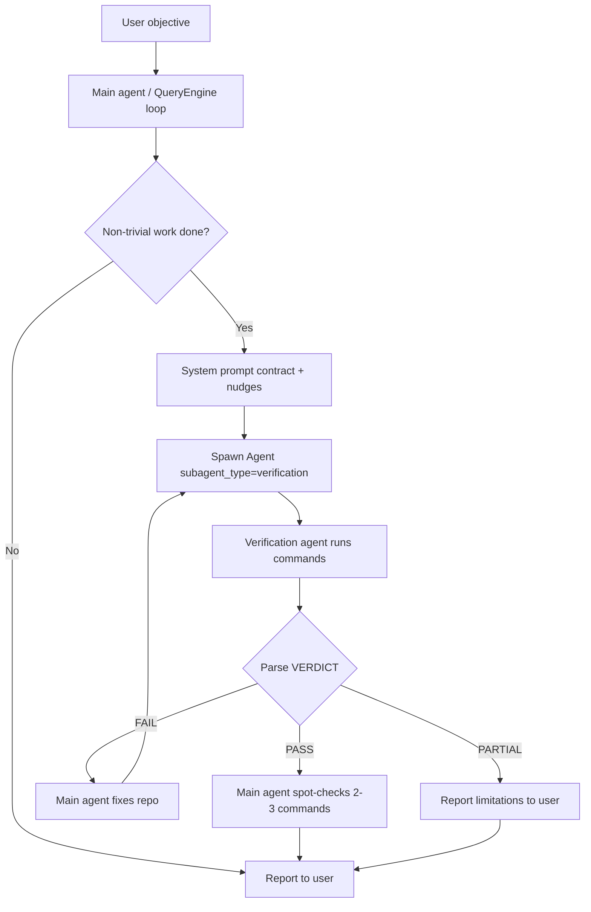

Here is a full end-to-end explainer of how Chakra implements **repo-level generation + non-deterministic validation/repair**, and how you can replicate that pattern in your headless harness.

---

## Core idea

Chakra does **not** run a deterministic validation pipeline. There is no `inspect → provision → execute steps → pass/fail` module.

Instead, everything is **LLM-orchestrated**: 

1. **One agent generates/edits code** (main agent or `general-purpose` subagent).
2. **A separate read-only agent verifies** by running real commands (build, test, curl, browser).
3. **The implementing agent repairs** based on verifier output.
4. **The loop repeats** until the verifier says `VERDICT: PASS` or the session ends.

Validation authority lives with the **verifier subagent**, not with the implementer. Repair authority lives with the **implementer**, not with a separate repair engine.

---

## End-to-end flow (Chakra)



---

## Layer 1: The runtime loop (where everything happens)

All work flows through **`query.ts`** → **`QueryEngine`**.

Rough cycle per turn:

1. User message arrives (REPL, SDK, or gRPC).
2. System prompt is assembled (`constants/prompts.ts` + project context).
3. LLM responds — either text or **tool calls** (Bash, Read, Write, Edit, Agent, etc.).
4. Tools execute (via `StreamingToolExecutor` / `runTools`).
5. Tool results go back into the conversation.
6. Loop continues until the model stops or hits max turns.

**Generation** is just the main agent using write tools (`FileWrite`, `FileEdit`, `Bash` with install commands, etc.) inside this loop.

There is no separate “generation service.”

---

## Layer 2: Agent roles (who does what)

Chakra splits work across **built-in subagent types** registered in `builtInAgents.ts`:

| Agent | Role | Can modify repo? |
|---|---|---|
| `general-purpose` | Research, multi-step implementation | Yes |
| `Explore` | Read-only codebase search | No |
| `plan` | Design before implementation | No (plan mode) |
| **`verification`** | Adversarial testing | **No** (read-only + run commands) |

### Generation agent

`generalPurposeAgent.ts` — standard implementer:

- Has access to all tools (`tools: ['*']`).
- Prompt: “Complete the task fully… respond with a concise report.”
- Creates/edits files, runs installs, writes tests.

### Verification agent

`verificationAgent.ts` — the heart of Chakra’s validation:

**Hard constraints (enforced three ways):**

1. **System prompt** — “STRICTLY PROHIBITED from creating/modifying/deleting project files.”
2. **`disallowedTools`** — blocks `FileEdit`, `FileWrite`, `NotebookEdit`, nested `Agent`, `ExitPlanMode`.
3. **`criticalSystemReminder_EXPERIMENTAL`** — repeated reminder each turn.

**What it actually does:**

1. Read `README` / `CLAUDE.md` / `package.json` for build/test commands.
2. Run build → test suite → linters.
3. Apply change-type strategy (frontend: start dev server + curl/browser; API: hit endpoints; CLI: run with edge inputs).
4. Run **adversarial probes** (concurrency, boundary values, idempotency).
5. Output structured checks with **real command output** (not “code looks correct”).
6. End with exactly:

```text
VERDICT: PASS
VERDICT: FAIL
VERDICT: PARTIAL
```

**Important:** `PARTIAL` is only for environmental limits (no Docker, no browser), not “I'm unsure.”

---

## Layer 3: How verification gets triggered (not automatic code — prompt enforcement)

Chakra does **not** have a hardcoded post-generation hook that always runs validation. It uses **multiple soft + hard nudges** so the main LLM chooses to spawn the verifier.

### A. Session contract in system prompt

When feature flags are on, `constants/prompts.ts` injects:

> When non-trivial implementation happens (3+ file edits, backend/API, infra changes), spawn `Agent` with `subagent_type="verification"` before reporting completion.
>
> On **FAIL**: fix → resume verifier → repeat until **PASS**.
>
> On **PASS**: spot-check 2–3 commands from verifier report.
>
> You cannot self-certify. Only the verifier assigns a verdict.

This is the **orchestrator logic**, but written as prompt law, not Python/TS workflow code.

### B. Structural nudges at “task complete” moments

When the agent closes a todo list without a verification step:

- **`TodoWriteTool`** — if 3+ todos completed and none mention “verif”, appends to tool result:
  > “Spawn verification agent before writing final summary…”

- **`TaskUpdateTool`** — same nudge for task-list v2.

These fire at the exact moment the agent might skip verification and declare done.

### C. Feature flags (verification is often OFF)

Verification agent is only registered when **both**:

```typescript
feature('VERIFICATION_AGENT') &&
getFeatureValue_CACHED_MAY_BE_STALE('tengu_hive_evidence', false)
```

Comment in code: **3P default is false**. So in many builds, verification doesn’t exist at all unless explicitly enabled.

### D. Plan-mode path (experimental / internal)

- `ExitPlanMode` can store `pendingPlanVerification` in app state.
- `VerifyPlanExecutionTool` is currently **`null`** (stubbed/disabled).
- `attachments.ts` has reminder logic gated on `USER_TYPE === 'ant'` and `CLAUDE_CODE_VERIFY_PLAN`.

So plan verification is designed but not fully shipped.

---

## Layer 4: Spawning and running the verifier

When the main agent calls the **Agent tool**:

```typescript
Agent({
  subagent_type: "verification",
  name: "verify-build",
  description: "Verify finance tracker implementation",
  prompt: "Original task: ... Files changed: ... Approach: ..."
})
```

`AgentTool.tsx` → `runAgent.ts`:

1. Loads `VERIFICATION_AGENT` definition.
2. Filters tools via `resolveAgentTools` (removes write tools).
3. Creates isolated subagent context with verification system prompt.
4. Runs a **nested `query()` loop** (same engine, separate message chain).
5. Subagent uses **Bash**, **Read**, **WebFetch**, optional **Playwright/Chrome MCP** tools.
6. Returns final report text to parent agent.

Parent agent reads the report, parses `VERDICT: ...`, and decides next step.

**Repair loop:** Parent agent (not verifier) uses `FileEdit`/`Bash` to fix, then spawns verifier again with:

> “Previous verifier found X. I applied fix Y. Re-verify.”

There is no `RepairEngine`. The main agent **is** the repair engine.

---

## Layer 5: Project-specific verifiers (optional second layer)

`/init-verifiers` (`init-verifiers.ts`) is a **meta-workflow**:

1. LLM scans repo (monorepo detection, stack, dev server scripts).
2. Asks user questions (dev server URL, auth, ready signal).
3. Writes `.claude/skills/verifier-*/SKILL.md` with project-specific instructions.
4. Future verification agents discover these skills by folder name containing `"verifier"`.

This is still **LLM-generated config + LLM execution** — but it makes verification more reliable per project over time.

Templates cover:

- **Playwright** for web UI
- **curl/http** for APIs
- **Tmux** for CLI apps

Unit tests and typecheck are explicitly **excluded** from verifier skills (“already handled by standard build/test workflow”).

---

## Layer 6: Other quality mechanisms (adjacent, not the main gate)

| Mechanism | Purpose |
|---|---|
| **`simplify` skill** | Post-change code quality review (3 parallel review agents) |
| **`batch` skill** | Worker contract: simplify → unit tests → e2e → commit |
| **`security-review` command** | Security-focused diff review prompt |
| **LSP passive feedback** | Live diagnostics attached to agent context while editing |
| **`doctor:runtime`** | Validates Chakra’s own environment, not your generated repo |
| **Bash read-only validation** | Blocks dangerous shell commands, not functional testing |

These supplement the main loop but don’t replace the verification agent contract.

---

## What Chakra explicitly does NOT do

- No deterministic step executor
- No structured `validation_report.json` from code (only LLM prose + optional logs)
- No failure classifier (infra vs repo bug)
- No provisioner (Docker/Mongo) as a separate deterministic module
- No orchestrator state machine (`ACCEPTED`, `REJECTED`, etc.)
- No guaranteed validation after every generation (depends on LLM following prompts + flags)

---

## Critical gotcha for YOUR setup (gRPC headless harness)

Your headless harness talks to Chakra via **gRPC** (`adapter/chakra/harness.py` → `AgentService.Chat`).

In `harness/chakra/src/grpc/server.ts`, the server creates QueryEngine like this:

```typescript
engine = new QueryEngine({
  cwd: req.working_directory,
  tools: getTools(appState.toolPermissionContext),
  commands: [],
  mcpClients: [],
  agents: [],   // ← empty!
  ...
})
```

**`agents: []` means built-in subagents (including `verification`) are NOT registered on the gRPC path.**

So today, when you run `run_pipeline.py` / `run_autonomous.py` through Chakra gRPC:

- You get the **main tool loop** (Bash, Read, Write, etc.).
- You do **not** get Chakra’s verification subagent machinery unless someone changes the gRPC server to pass `getBuiltInAgents()`.

This is likely why your harness built its own validation/repair pipeline — the gRPC backend is a **stripped-down agent runtime**, not the full interactive Chakra CLI experience.

---

## How to replicate Chakra’s approach in your headless harness

To do it “the Chakra way” (non-deterministic, repo-level), you replicate the **roles and prompt contract** using your existing **Controller + ExecutionEngine + ChakraHarness** stack — not by importing Chakra TS files.

### Recommended architecture (mirrors Chakra)

```text
PipelineOrchestrator (you already have this)
    │
    ├─ Stage 1: GENERATE
    │     Controller.run(objective)          ← general-purpose agent
    │     working_directory = repo/
    │
    ├─ Stage 2: VERIFY (new LLM stage)
    │     Controller.run(verification_objective)
    │     Same harness, but controller policy restricts to read-only actions
    │     OR separate "verification mode" in prompt
    │     Parse VERDICT: PASS|FAIL|PARTIAL from final summary
    │
    ├─ Stage 3: REPAIR (on FAIL)
    │     Controller.run(repair_objective + verifier findings)
    │     Full write access again
    │
    └─ Loop VERIFY → REPAIR until PASS or max iterations
```

### Stage 1 — Generation (you mostly have this)

Same as today:

```bash
python run_pipeline.py --objective "Build a Node finance tracker" --output runs/
```

Controller drives Chakra to write files and install deps.

### Stage 2 — Verification controller turn

Add a **second controller run** whose objective is adapted from Chakra’s `VERIFICATION_SYSTEM_PROMPT` in `verificationAgent.ts`. Include:

- Original user objective
- List of files changed (from git diff or generation trace)
- Approach summary from generation
- Explicit constraints: **do not modify project files**
- Required output format with `Command run` / `Output observed` / `Result`
- Final line: `VERDICT: PASS|FAIL|PARTIAL`

**Verification objective template (conceptual):**

```text
You are a verification specialist. DO NOT modify any files in {repo_path}.

Original task: {objective}
Files changed: {file_list}
Approach taken: {generation_summary}

1. Read README/package.json for build/test commands
2. Run build, tests, linters
3. Start server if needed; curl endpoints / run e2e checks
4. Run at least one adversarial probe
5. Every check must include exact command + copied output
6. End with exactly: VERDICT: PASS | FAIL | PARTIAL
```

Parse the controller’s final summary with a simple regex:

```python
VERDICT_RE = r"VERDICT:\s*(PASS|FAIL|PARTIAL)"
```

### Stage 3 — Repair (on FAIL)

Third controller run — essentially what your `RepairPlanner` already does, but fed from **verifier prose** instead of `validation_report.json`:

```text
The verification agent reported FAIL:

{verifier_report}

Fix the repository with minimal changes. Do not disable tests.
After fixing, summarize what you changed.
```

Then go back to Stage 2.

### Stage 4 — Spot-check on PASS (Chakra’s extra gate)

After `VERDICT: PASS`, Chakra’s main agent re-runs 2–3 commands from the verifier report. You can add:

- A lightweight deterministic re-run of commands extracted from the report, OR
- A tiny “spot-check” controller turn: “Re-run these 3 commands and confirm output matches”

This catches verifier hallucination.

### Enforcement mechanisms to copy from Chakra

Since you don’t have TodoWrite nudges, put the contract in **controller system prompt / policies**:

| Chakra mechanism | Your equivalent |
|---|---|
| `prompts.ts` verification contract | Add to `ControllerConfig` system prompt or `prompt_builder.py` |
| TodoWrite verification nudge | Orchestrator always runs verify stage (don’t rely on LLM choosing) |
| `disallowedTools` on verifier | Controller policy: block write actions during verify turn, OR separate verify prompt that says “only use read/bash” |
| `VERDICT:` parsing | Orchestrator parses summary — **you** own the gate, not the LLM |
| Feature flag gating | Your pipeline config: `enable_llm_verification: true` |

**Key advantage over Chakra:** Your orchestrator **mandates** verification after generation. Chakra **asks** the LLM nicely and hopes it complies.

---

## Optional: project-specific verifier skills (Chakra’s `/init-verifiers`)

Run once per repo type (could be a controller turn during or after generation):

1. Scan repo structure
2. Write `repo/.harness/verifier.md` with:
   - Dev server command
   - Base URL
   - Ready signal string
   - Auth test credentials (env vars)
   - API endpoints to curl

Then every verification turn includes: “Follow instructions in `.harness/verifier.md`.”

This gives you Chakra’s skill-based customization without `.claude/skills/`.

---

## Hybrid approach (recommended)

You don’t have to throw away your deterministic pipeline. Chakra itself treats unit tests as “context, not evidence” but still runs them. A practical hybrid:

```text
1. Deterministic ValidationPipeline  → catches install/build/test/startup cheaply
2. If pass (or partial) → LLM verification agent  → adversarial E2E
3. If either fails → LLM repair with structured diagnostics
4. Repeat
```

Deterministic layer = fast, reproducible, good logs.  
LLM verification layer = Chakra-style “try to break it” for things scripts miss.

---

## Minimal implementation checklist for you

1. **Add `LLMVerificationStage`** to `orchestrator/pipeline.py` after generation (or after deterministic validation).
2. **Create `verification_prompt.py`** — port key sections from `verificationAgent.ts` (strategy, adversarial probes, output format, VERDICT).
3. **Add `parse_verdict(summary) -> PASS|FAIL|PARTIAL|None`** in orchestrator.
4. **Wire repair loop:** FAIL → repair controller turn with verifier report → re-verify.
5. **Optionally enable gRPC agents** — modify Chakra’s `grpc/server.ts` to pass `getBuiltInAgents()` instead of `agents: []` if you want native subagent spawning (requires Chakra rebuild; folder is read-only in your project so this would be upstream change).
6. **Store artifacts:** `verification_report.md`, `verdict.json`, `repair_history.jsonl` under `runs/run_*/`.

---

## Summary

| Aspect | Chakra | Your headless harness today |
|---|---|---|
| Validation style | LLM verifier subagent | Deterministic `ValidationPipeline` |
| Repair | Main agent fixes after FAIL | `RepairExecutor` + Controller |
| Loop owner | Prompt contract + LLM discipline | `PipelineOrchestrator` |
| Acceptance gate | `VERDICT: PASS` from verifier | `ValidationVerdict.PASS` |
| gRPC support | Agents disabled (`agents: []`) | Uses gRPC for generation/repair only |
| Reproducibility | Low (LLM decides commands) | High (structured reports) |

To do it **the Chakra way**, you add **LLM verification + LLM repair loops** orchestrated by your pipeline, using Chakra’s **verification prompt and role separation** as the blueprint — not Chakra’s TypeScript modules directly.

If you want, switch to Agent mode and I can implement the `LLMVerificationStage` + verdict parser + orchestrator wiring as a concrete Phase 10 addition on top of your existing pipeline.


based on this the instrucitons:


# Refactor Validation & Repair to use Chakra as the Verification Engine

## Objective

Refactor the autonomous pipeline so that repository validation and repair are performed entirely by Chakra through the existing Harness Interface.

The orchestrator should no longer perform deterministic validation or repository analysis.

Instead, the orchestrator becomes responsible only for coordinating the pipeline, launching stage-specific controller runs, parsing verification verdicts, and repeating the verification–repair cycle until the repository is accepted or the repair limit is reached.

The implementation should closely mirror Chakra's own architecture where:

- generation is performed by an implementation agent
- verification is performed by a verification agent
- repair is performed by an implementation agent
- the orchestrator owns the workflow

The backend remains a complete black box.

---

# High-Level Architecture

```
Objective
    │
    ▼
Generation
    │
    ▼
Verification
    │
    ▼
Parse VERDICT
    │
    ├──────── PASS ─────────► Accept Repository
    │
    ├──────── FAIL ─────────► Repair
    │                           │
    │                           ▼
    │                    Verification
    │                           │
    │                           ▼
    │                  Repeat Until PASS
    │                  or Maximum Attempts
    │
    └──────── PARTIAL ─────► Configurable Policy
```

The orchestrator owns the workflow.

Chakra owns all software engineering work.

---

# Core Design Principle

The orchestrator must never attempt to perform software engineering itself.

It must never:

- inspect repository files
- determine root causes
- analyse compiler errors
- analyse stack traces
- decide which files require repair
- determine build commands
- determine test commands

Instead it only:

1. Generate repository
2. Ask Chakra to verify it
3. Parse the returned VERDICT
4. Ask Chakra to repair if necessary
5. Repeat verification

All engineering decisions remain inside Chakra.

---

# Controller Runs vs Chakra Sessions

It is important to distinguish between a Controller Run and a Chakra Session.

A Controller Run represents one execution stage of the pipeline.

A Chakra Session represents the persistent backend conversation.

Every pipeline stage should create a completely new Controller run with a stage-specific objective.

However, every stage should reuse the same Chakra Session created during generation.

Pipeline:

```
Controller Run 1
Generation
        │
        ▼
Chakra Session A

↓

Controller Run 2
Verification
        │
        ▼
Resume Chakra Session A

↓

Controller Run 3
Repair
        │
        ▼
Resume Chakra Session A

↓

Controller Run 4
Verification
        │
        ▼
Resume Chakra Session A
```

This provides:

- isolated controller reasoning
- clean traces
- stage-specific prompts
- persistent backend project knowledge

The backend may still re-read repository files whenever required.

---

# Stage 1 — Generation

The current generation pipeline remains unchanged.

Generation creates:

- repository
- generation summary
- Chakra session

The returned Chakra session becomes the session reused by every subsequent stage.

---

# Stage 2 — Verification

Immediately after generation completes, automatically launch a completely new Controller run.

Reuse the existing Chakra Session.

Do not create a new backend session.

The verification Controller receives a single objective.

Its job is only to send the complete verification instruction to Chakra.

It must not decompose verification into multiple messages.

The backend performs all verification work.

---

# Verification Prompt

Create a reusable verification prompt builder.

The prompt should closely follow Chakra's verification agent strategy.

The prompt must instruct Chakra to:

- inspect the repository
- read README and project documentation
- determine the build process
- determine the execution process
- determine the testing process
- inspect source code using Read, Grep and Glob
- execute builds
- execute tests
- execute runtime validation
- investigate failures
- perform adversarial testing where appropriate
- never modify repository files
- finish with exactly one verdict

Accepted verdicts:

```
VERDICT: PASS

VERDICT: FAIL

VERDICT: PARTIAL
```

The verification response should also include a complete engineering report describing:

- commands executed
- outputs observed
- failures discovered
- reasoning
- recommendations

The repair stage consumes this report.

---

# Verification Controller Mode

Introduce a Relay Mode for the Controller.

Relay Mode means:

- send one complete message
- wait while Chakra performs the entire verification
- respond to ActionRequired events if necessary
- return Chakra's final response unchanged

Relay Mode does NOT disable interaction with Chakra.

Chakra continues to:

- invoke tools
- request approvals
- ask follow-up questions if necessary
- read files
- grep code
- execute commands

The controller simply forwards the conversation instead of planning it.

---

# Stage 3 — Verdict Parsing

The orchestrator owns repository acceptance.

Implement a verdict parser.

Accepted values:

PASS

FAIL

PARTIAL

Missing verdicts should be treated as verification failure.

The orchestrator decides the next stage solely from the parsed verdict.

---

# Stage 4 — Repair

When verification returns FAIL:

Launch a completely new Controller run.

Reuse the same Chakra Session.

Repair receives:

- original objective
- repository path
- complete verification report

The repair prompt should instruct Chakra to:

- investigate verification failures
- use Read and Grep before editing
- make minimal changes
- preserve working behaviour
- re-run failing commands during repair
- summarize modifications

Repair must NOT return a verdict.

Its only responsibility is repository modification.

---

# Stage 5 — Verification Loop

Immediately after every repair:

launch another verification Controller run.

Reuse the same Chakra Session.

Pipeline:

```
Generate

↓

Verify

↓

FAIL

↓

Repair

↓

Verify

↓

FAIL

↓

Repair

↓

Verify

↓

PASS

↓

Accept
```

Continue until:

- PASS
- maximum repair attempts

---

# Conversation Isolation

Every stage creates a fresh Controller run.

Generation

Verification 1

Repair 1

Verification 2

Repair 2

...

Every Controller run has:

- independent prompt
- independent reasoning
- independent trace

However, all stages share the same Chakra Session so backend project memory is preserved.

---

# Trace Layout

Every stage produces its own trace.

Example:

```
logs/

run_generate/
    trace.jsonl

run_verify_01/
    trace.jsonl

run_repair_01/
    trace.jsonl

run_verify_02/
    trace.jsonl
```

This keeps traces clean and independently debuggable.

---

# Stage Artifacts

Verification stores:

```
verification_report.md

verdict.json
```

Repair stores:

```
repair_summary.md
```

Generation stores:

```
generation_summary.md
```

---

# Prompt Builders

Create reusable prompt builders.

```
orchestrator/
    prompts/
        generation.py
        verification.py
        repair.py
```

Each builder constructs only prompts.

No execution logic belongs here.

---

# Controller Modes

Support two controller modes.

Normal Mode

- existing behaviour
- used during generation

Relay Mode

- send one complete message
- wait for Chakra
- handle ActionRequired events
- return final backend response

Verification and Repair always use Relay Mode.

---

# Pipeline Ownership

The orchestrator owns:

- stage transitions
- controller lifecycle
- verdict parsing
- retry policy
- repair loop
- repository acceptance

Chakra owns:

- repository inspection
- repository understanding
- build discovery
- test discovery
- command execution
- debugging
- verification
- repair
- engineering reasoning

No software engineering logic should exist inside the orchestrator.

---

# Acceptance Criteria

The implementation is complete when:

- generation is performed entirely through Chakra
- verification is performed entirely through Chakra
- repair is performed entirely through Chakra
- verification automatically follows generation
- repair automatically follows failed verification
- verification automatically reruns after repair
- the same Chakra Session is reused across every stage
- every stage creates a fresh Controller run
- every stage produces an isolated trace
- repository acceptance is determined only from VERDICT
- the orchestrator contains no deterministic repository validation logic