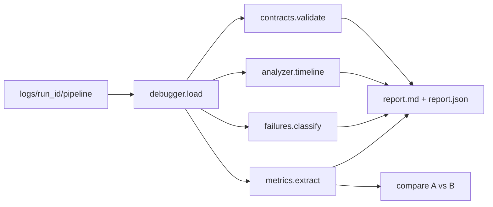

# Autonomous Harness Debugger

Standalone analysis tool (does **not** change Chakra/`harness/`). Consumes existing pipeline artifacts and optionally enriches future traces with decision reasons.



## Package layout

```text
headless_harness_datagen/debugger/
  __init__.py
  __main__.py              # python -m debugger …
  cli.py
  load.py                  # wrap load_trace_bundle + summary.json/verdict.json
  contracts/
    definitions.py         # Phase 1 contracts as data
    validate.py            # validate a loaded run → violations[]
  analyze.py               # Phase 2 structured RunAnalysis
  decisions.py             # Phase 3 extract + format decision timeline
  taxonomy.py              # Phase 4 FailureClassification
  metrics.py               # Phase 5 Metrics + compare()
  report.py                # markdown + JSON writers
  templates/               # optional markdown sections
scripts/debug_run.py       # thin CLI alias → debugger.cli
tests/test_debugger_*.py
docs/DEBUGGER.md           # operator guide + contract reference
```

Reuse: [`controller/trace_replay.py`](headless_harness_datagen/controller/trace_replay.py) (`load_trace_bundle`, `reconstruct_conversation`, `merge_timeline`).

Default I/O:

```bash
python -m debugger analyze logs/run_test
# writes logs/run_test/pipeline/debug/report.md + report.json

python -m debugger compare logs/run_a logs/run_b
# writes stdout table + optional debug/compare.json
```

---

## Phase 1 — Component contracts

Define contracts in [`debugger/contracts/definitions.py`](headless_harness_datagen/debugger/contracts/definitions.py) as typed dataclasses (not free-form prose only):

| Component | Key invariants (examples) |
|-----------|---------------------------|
| Bootstrap / Plan | Prefer Plan spawn before implement markers; `plan.md` or `plan_agent_seen` before `IMPLEMENTATION_STATUS` |
| Implementation | `ENV_STATUS: READY` + `IMPLEMENTATION_STATUS: COMPLETE` from general-purpose before first accepted verify |
| Verification | Authoritative `VERDICT` only from verification Agent; **PASS requires `RUNTIME_CHECK: PASS`** (align with [`verification/parser.py`](headless_harness_datagen/verification/parser.py)) |
| Repair | After FAIL/PARTIAL: repair planning and/or GP repair before next verify cycle; `REPAIR_STATUS: COMPLETE` before re-verify when repair path taken |
| Resume nudges | Logged `resume_nudge.kind` matches lifecycle gap (repair_planning / implement / verification / …) |
| Session health | Termination reasons (`max_turns`, stall, etc.) consistent with `run_completed` |
| Tool approval | Agent spawn has `subagent_type` ∈ allowed set |

`validate(run) → list[ContractViolation]` with `{component, rule_id, severity, evidence_seq, message}`.

Document the same table in [`docs/DEBUGGER.md`](headless_harness_datagen/docs/DEBUGGER.md). Link from [`docs/HANDOVER.md`](headless_harness_datagen/docs/HANDOVER.md).

---

## Phase 2 — Run analyzer

[`debugger/analyze.py`](headless_harness_datagen/debugger/analyze.py) builds `RunAnalysis`:

- **Timeline** — merged normalized events (collapse `assistant_text_delta` into per-turn blobs for readability)
- **Agent lifecycle** — `agent_spawn` / `agent_completed` by `subagent_type` + invocation_id
- **Tool usage** — counts by tool name; Bash/runtime command extraction from args when present
- **Files read/edited** — from Read/Edit/Write tool args
- **Token / compact stats** — from `token_usage` + `context_compacted`
- **Verification history** — `verification_result` + last_pass_rejection from lifecycle snapshots / summary
- **Repair history** — nudge kinds + GP repair completions + `repair_plan.md` mentions
- **Termination** — `run_completed.termination_reason`, `completed`, health
- **Root cause stub** — filled after Phase 4

Emit via [`debugger/report.py`](headless_harness_datagen/debugger/report.py):

- Executive summary
- Timeline (abbreviated)
- Lifecycle validation (Phase 1)
- Contract violations
- Failure classification (Phase 4)
- Metrics (Phase 5)
- Root cause + recommendations

---

## Phase 3 — Decision logging (live traces)

Existing coverage: `resume_nudge` (non-neutral), `tool_approval`, `controller_action` (legacy path). Gaps: soft continues, terminations, why a nudge kind was chosen.

**Instrument lightly** (no behavior change):

1. [`controller/conversation_runner.py`](headless_harness_datagen/controller/conversation_runner.py) — on every resume, log:

```json
{"type":"controller_decision","decision":"resume","kind":"<nudge.kind>","reason":"<short>","message_preview":"..."}
```

including **neutral** soft continues (today those are silent).

2. [`controller/orchestration_state.py`](headless_harness_datagen/controller/orchestration_state.py) / [`resume_nudges.py`](headless_harness_datagen/controller/resume_nudges.py) — attach `reason` string on `ResumeNudge` (e.g. `"VERDICT: FAIL and no repair_plan.md"`).

3. On run end — log `controller_decision` with `decision=terminate`, `reason=termination_reason`.

Debugger Phase 3 section reads these + tool approvals chronologically. Older traces without the field still analyze; decision section notes “partial / inferred.”

---

## Phase 4 — Failure taxonomy

[`debugger/taxonomy.py`](headless_harness_datagen/debugger/taxonomy.py) maps evidence → categories:

| Category | Signals |
|----------|---------|
| Provider | gRPC cancel, auth errors, quota/timeout strings in errors |
| Controller | Bad/missing nudge vs lifecycle gap; intervention denials that block progress; stall loops |
| Implementation | No `IMPLEMENTATION_STATUS`; syntax/runtime Bash failures; missing files in tool errors |
| Verification | PASS without RUNTIME_CHECK; self-assigned verdict; false FAIL patterns |
| Lifecycle | Invalid transition (verify before implement); missing repair after FAIL; repair iterations exhausted |
| Limits | `max_turns`, `max_repair_iterations`, health terminate |

Output: `primary_failure`, `secondary_failures[]`, `confidence`, `evidence_seqs[]`. Recommendations are rule templates (“add RUNTIME_CHECK gate already present — check verifier spawn quality”, etc.).

---

## Phase 5 — Metrics and compare

[`debugger/metrics.py`](headless_harness_datagen/debugger/metrics.py) extracts:

runtime (first→last ts), prompt/completion tokens (sum `token_usage`), agent_count by type, tool_calls, file_reads/edits, runtime Bash executions, test-like commands, repair_iterations (`verdict_fail_count` / repair nudges), verification_failures, duplicate reads/edits (same path counted >1), final_status.

`compare(run_a, run_b) → table` printed by CLI and written to JSON.

---

## Tests

- `tests/test_debugger_load.py` — load sample `logs/run_test/pipeline` (or fixture slice)
- `tests/test_debugger_contracts.py` — synthetic traces violating PASS-without-RUNTIME_CHECK
- `tests/test_debugger_taxonomy.py` — classify max_turns / rejected PASS
- `tests/test_debugger_metrics.py` — compare two tiny fixtures
- `tests/test_debugger_decisions.py` — ResumeNudge carries `reason`; runner logs `controller_decision` (unit with temp trace)

Keep fixtures small under `tests/fixtures/debugger/` if full `run_test` traces are huge.

---

## Docs

- [`docs/DEBUGGER.md`](headless_harness_datagen/docs/DEBUGGER.md) — how to run, contracts, taxonomy
- Short link in [`docs/HANDOVER.md`](headless_harness_datagen/docs/HANDOVER.md) under tests/tools

---

## Explicit non-goals

- No web UI / canvas in this pass (CLI + markdown/JSON only)
- No changes under `harness/`
- Debugger never mutates experiment repos; only writes under `logs/.../debug/`
