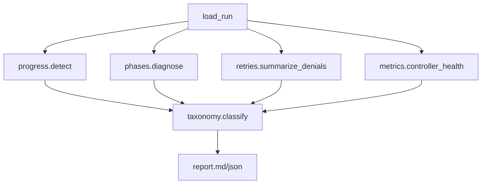

# Debugger diagnosis upgrades

Extend existing offline analysis only (no `harness/` changes). Knobs: CLI flag `--stall-cycles` on `analyze` (default **5**), documented in [`docs/DEBUGGER.md`](headless_harness_datagen/docs/DEBUGGER.md).

## 1. Progress detector — [`debugger/progress.py`](headless_harness_datagen/debugger/progress.py)

Define a **controller cycle** as each `controller_decision` with `decision=resume` (fallback: `resume_nudge`).

**Meaningful progress** between cycles (any one resets the stall counter):

- New unique file path in `Read` tool args
- Any `Edit` / `Write` path
- `agent_completed` (any subagent)
- New `agent_spawn` with a *new* `subagent_type` not seen before
- Lifecycle-relevant markers in agent/assistant text or lifecycle snapshot deltas: `ENV_STATUS`, `IMPLEMENTATION_STATUS`, `REPAIR_STATUS`, `plan.md` / `plan_done`
- `verification_result`

Emit `ProgressAnalysis`:

- `progress_events[]` (`seq`, `kind`, `detail`)
- `stalls[]` with `{start_seq, end_seq, cycles_without_progress, last_progress_kind}`
- `forward_progress_stall: bool` if any stall has `cycles_without_progress >= stall_cycles`
- `max_consecutive_no_progress_cycles: int`

Wire `stall_cycles` through [`analyze_run(..., stall_cycles=5)`](headless_harness_datagen/debugger/analyze.py) and CLI.

## 2. Phase-aware diagnosis — [`debugger/phases.py`](headless_harness_datagen/debugger/phases.py)

For each phase `{plan, implementation, verification, repair}` produce:

| Status | Rule (from lifecycle snapshot + agent_spawn / verification_result) |
|--------|---------------------------------------------------------------------|
| `never_reached` | No spawn/markers for that phase |
| `entered` | Spawn or markers seen, not terminal success/fail |
| `succeeded` | Phase success markers (e.g. plan_done, IMPLEMENTATION_STATUS, authoritative PASS, REPAIR_STATUS) |
| `failed` | Phase entered then FAIL/rejection/exhaustion |

Habit_tracker expectation: only Explore → **implementation / verification / repair = `never_reached`** (plan likely `never_reached` or weak Explore-only bootstrap). Report section **Phase diagnosis** lists status + evidence; taxonomy uses `never_reached` vs `failed` messaging (not “Never saw IMPLEMENTATION_STATUS” as if implement was attempted).

## 3. Retry / denial summarization — [`debugger/retries.py`](headless_harness_datagen/debugger/retries.py)

From `tool_approval` events where response/reasoning starts with `deny` / `no`:

- Group key: `(tool_name, normalized_command_or_path, reason_prefix)`
- Prefer command from paired nearby `tool_request` / intervention args when present; else reason text
- Emit summaries like: `Repeated identical Bash command denied 8 times` with first/last `seq` and sample command

[`decisions.extract_decisions`](headless_harness_datagen/debugger/decisions.py) / report **Controller decisions** section: show **summaries first**, then non-denial approvals abbreviated (cap raw denial lines).

## 4. Controller health metrics — extend [`debugger/metrics.py`](headless_harness_datagen/debugger/metrics.py)

Add fields (also in compare table where numeric):

- `max_consecutive_resumes_without_progress` (from progress module)
- `forward_progress_stall` (bool)
- `denied_tool_requests_by_reason: dict[str,int]` (bucketed reason prefixes)
- `avg_seconds_between_progress_events` (from progress event timestamps; `null` if &lt;2 events)
- `denial_summary_count` / top denial groups count

## 5. Root-cause inference — rewrite ranking in [`debugger/taxonomy.py`](headless_harness_datagen/debugger/taxonomy.py)

**Causal priority** (primary = first match; terminal limits demoted):

1. Provider (auth/quota/timeout)
2. Controller **forward progress stall** / exploration stall (from progress + only Explore / no Plan|GP)
3. Heavy identical-denial loops (top denial group count ≥ threshold, default 5)
4. Phase `never_reached` when pipeline expected to advance (stuck before implement)
5. Lifecycle / verification / implementation **failures** (phase was entered)
6. Limits (`max_turns`, etc.) as **outcome** → secondary when a causal item exists; primary only if nothing else

For habit_tracker: primary ≈ `Controller` / `Forward progress stall` (or `Exploration stall`); secondary includes `Limits/max_turns` and phase never-reached notes.

Add recommendations accordingly (“spawn Plan/general-purpose; stop retrying denied out-of-repo Bash”).

## 6. Report / CLI / docs

Update [`debugger/report.py`](headless_harness_datagen/debugger/report.py):

- Executive summary: primary causal failure + “Termination outcome: max_turns”
- New sections: **Phase diagnosis**, **Progress / stalls**, **Denial summaries**, **Controller health**
- Collapse denial spam in decisions section

[`debugger/cli.py`](headless_harness_datagen/debugger/cli.py): `--stall-cycles` (default 5).

Update [`docs/DEBUGGER.md`](headless_harness_datagen/docs/DEBUGGER.md).

## 7. Tests

- `tests/test_debugger_progress.py` — synthetic resume cycles with/without progress; stall flag at threshold
- `tests/test_debugger_phases.py` — Explore-only fixture → implement/verify/repair `never_reached`
- `tests/test_debugger_retries.py` — 8 identical Bash denials → one summary
- Extend `tests/test_debugger_taxonomy.py` — max_turns + stall → primary is stall, limits secondary
- Small fixture under `tests/fixtures/debugger/run_explore_stall/` mirroring habit_tracker pattern (Explore + neutral resumes + repeated denials + max_turns)

## Non-goals

- No live runner behavior changes (offline analysis only)
- No web UI
- No mutation of experiment repos
