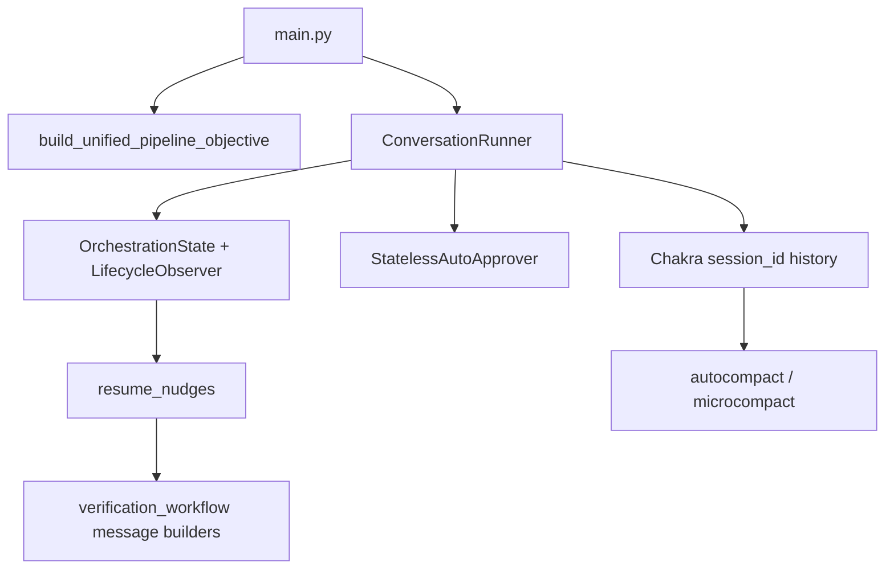

# Handover Documentation and Legacy Cleanup

## Current architecture (what the next owner must know)



Production path: one Chakra conversation owns Plan → implement → verify → repair. Python supervises (approve tools, traces, health, completion, phase resume nudges). Recent work also includes RUNTIME_CHECK gates, repair nudges after FAIL/rejected PASS, and earlier autocompact via `CLAUDE_AUTOCOMPACT_PCT_OVERRIDE`.

**Do not touch:** [`harness/`](headless_harness_datagen/harness/) (out of scope).

---

## Part A — Handover document

Create [`docs/HANDOVER.md`](headless_harness_datagen/docs/HANDOVER.md) as the single entry for a new owner. Contents:

1. **What this repo is** — headless harness over Chakra gRPC; entry [`main.py`](headless_harness_datagen/main.py)
2. **How to run** — start Chakra, venv, example `main.py` command, key env vars (including autocompact)
3. **Architecture** — single conversation; Python vs Chakra ownership table
4. **Lifecycle markers** — `ENV_STATUS`, `IMPLEMENTATION_STATUS`, `RUNTIME_CHECK`, `VERDICT`, `REPAIR_STATUS`
5. **Resume nudges** — when Python steers (rejected PASS → reverify; FAIL → repair plan → GP → reverify)
6. **Key files map** — production KEEP list (see below)
7. **Layout** — `scripts/` (operator tools) vs `tests/` (all automated tests)
8. **What was removed / archived** — pointer to this cleanup
9. **What not to delete** — especially `verification_workflow.py` builders, `resume_nudges.py`, `lifecycle.py`, `parser.py`
10. **Tests to run** — from `tests/` via `python scripts/run_all_real_tests.py` or individual `python tests/test_lifecycle.py`
11. **Known follow-ups** — Phase 6 Controller tests are legacy-facing but still valid regression

Also update [`README.md`](headless_harness_datagen/README.md) with a short “Handover” link to `docs/HANDOVER.md`, rewrite all `scripts/test_*` paths to `tests/test_*`, and rewrite the Stage-1/Stage-2 section of [`docs/architecture_reference.md`](headless_harness_datagen/docs/architecture_reference.md) so it matches Phase 7 (today it still claims a second conversation + `GenerationWorkflowPolicy` / `VerificationWorkflowPolicy` driving the loop — that is wrong for `main.py`).

Keep [`docs/refactoring.md`](headless_harness_datagen/docs/refactoring.md) as the design rationale; keep [`docs/development_journal.md`](headless_harness_datagen/docs/development_journal.md) as historical journal (do not delete).

---

## Part B — Safe code removals (confirmed unused)

These are unused by the production path and only pulled in by re-exports / dedicated legacy tests:

| Remove | Reason |
|--------|--------|
| [`controller/generation_workflow.py`](headless_harness_datagen/controller/generation_workflow.py) | Old `GenerationWorkflowPolicy`; implement nudge lives in `resume_nudges._build_implement_message` |
| `scripts/test_generation_workflow.py` (after move: delete, do not relocate) | Only tests that policy |

Then update:

- [`controller/__init__.py`](headless_harness_datagen/controller/__init__.py) — drop `GenerationWorkflowPolicy` / planning-message re-exports
- [`scripts/run_all_real_tests.py`](headless_harness_datagen/scripts/run_all_real_tests.py) — point at `tests/` paths; omit generation workflow test

### Slim (do not delete file)

[`controller/verification_workflow.py`](headless_harness_datagen/controller/verification_workflow.py):

- **Keep** all `build_verification_*` / `build_repair_*` helpers (imported by [`resume_nudges.py`](headless_harness_datagen/controller/resume_nudges.py))
- **Remove** the `VerificationWorkflowPolicy` class (dead decide-loop; not used by `main.py`)
- Slim the verification workflow test (after move under `tests/`) to builder-only cases
- Drop `VerificationWorkflowPolicy` from `controller/__init__.py`

### Stage prompt helpers (legacy two-stage)

In [`verification/prompts.py`](headless_harness_datagen/verification/prompts.py):

- **Keep** `build_unified_pipeline_objective` (production)
- **Remove** `build_generation_objective` and `build_verification_stage_objective` if only referenced by tests after cleanup
- Update [`verification/__init__.py`](headless_harness_datagen/verification/__init__.py) and tests that import them to assert on the unified prompt instead

---

## Part C — Docs cleanup (archive, not silent delete of journals)

Move historical / duplicate docs into [`docs/archive/`](headless_harness_datagen/docs/archive/):

- `phase_plan.md`, `phase_plan copy.md`
- `plan.md`, `plan_extension.md`, `sys_architecture.md`, `validator_idea_chakra.md`, `project_prompts.md`, `explicit_backend_agent_call.md`, `chakra_directory_state_manamegent.md`
- `phase1/`, `phase2/`, `knowedge_base/` (drop byte-identical `persistent copy.md`)

Delete empty / pure duplicates:

- `docs/prompt.md` if still empty

Leave at top level of `docs/`:

- `HANDOVER.md` (new)
- `architecture_reference.md` (rewritten for Phase 7)
- `refactoring.md`
- `development_journal.md`

---

## Part D — Artifact hygiene (not experiment source deletion)

**Do not delete** [`experiments/`](headless_harness_datagen/experiments/) project trees (e.g. `arade_n`) — those are run outputs the team may still inspect.

Update [`.gitignore`](headless_harness_datagen/.gitignore):

```
logs/
experiments/**/.venv/
experiments/**/__pycache__/
*.egg-info/
```

Optionally note in HANDOVER that local `logs/` can be wiped anytime (traces are regenerable). No automated mass-delete of `logs/` or experiment code in this cleanup pass.

**Do not remove:** `client/mock_server.py`, Phase 2–6 tests (relocated under `tests/`), `Controller` / `ControllerRunResult`, `prompt_builder.py` / `policies.py`, `workflow_common.py`, `resume_nudges.py`, `lifecycle.py`, adapter/engine/interface stacks.

---

## Part E — Reorganize tests vs scripts

Today almost every automated check lives under [`scripts/`](headless_harness_datagen/scripts/) as `test_*.py` plus `phase*_common.py` helpers. Split that:

### Target layout

```
headless_harness_datagen/
  scripts/          # operator + infra only
  tests/            # all automated tests + phase helpers
```

### Move into `tests/`

- Every `scripts/test_*.py` (except delete `test_generation_workflow.py` as part of Part B)
- Shared helpers: `phase2_common.py`, `phase3_common.py`, `phase4_common.py`, `phase5_common.py`, `phase6_common.py`

Preserve relative imports by keeping each file’s `REPO_ROOT = Path(__file__).resolve().parent.parent` pattern (still correct when files live one level under `tests/`).

Optional light grouping (only if paths stay simple for the runner):

```
tests/
  phase2_common.py … phase6_common.py
  test_phase2_*.py … test_phase7_*.py
  test_lifecycle.py
  test_conversation_runner.py
  …
```

Flat `tests/` (no nested packages) is the default to avoid package/`__init__` churn.

### Keep in `scripts/` (important operator/infra only)

| File | Why |
|------|-----|
| `start_chakra.sh` | Start Chakra + autocompact env |
| `real_backend.py` | Imported by `main.py` / runners for env, timeouts, workdir |
| `run_autonomous.py` | Generation-only CLI sibling of `main.py` |
| `run_query.py` | Manual single-turn operator tool |
| `run_all_real_tests.py` | Test runner (update lists to `tests/…`) |
| `generate_proto.py` | Proto codegen utility |
| `verify_chakra.py` | Backend smoke/verify helper |
| `smoke_chakra_subagents.py` | Subagent registry smoke (operator-facing) |

Move `test_connectivity.py` and `test_minimal_chat.py` into `tests/` as well; document them in README/HANDOVER as “first smoke checks” (`python tests/test_connectivity.py`). Do not leave a parallel copy under `scripts/`.

### Wiring updates after the move

- Rewrite path lists in [`scripts/run_all_real_tests.py`](headless_harness_datagen/scripts/run_all_real_tests.py) from `scripts/test_*.py` → `tests/test_*.py`
- Fix any `phase*_common` imports inside moved tests (`from phase2_common` still works if both live in `tests/` and `sys.path` includes `tests/` or they use relative imports — prefer inserting `REPO_ROOT` only and `from tests.phase2_common` only if needed; simplest is keep `sys.path.insert(0, str(REPO_ROOT))` and `sys.path.insert(0, str(REPO_ROOT / "tests"))` in commons, or have tests import commons as sibling modules by adding `tests/` to path in each file the same way scripts did for repo root)
- Update README / HANDOVER command examples
- Confirm `main.py` still imports `scripts.real_backend` unchanged

---

## Part F — Verification after cleanup

Run:

```bash
python tests/test_lifecycle.py
python tests/test_supervisor_policy.py
python tests/test_context_budget.py
python tests/test_verification_workflow.py   # builder-only after slim
python tests/test_phase7_verification.py    # updated for unified prompt
python scripts/run_all_real_tests.py        # contract subset if Chakra up, or contract-only mode if available
```

Confirm `main.py` still imports cleanly (`python -c "import main"`).

---

## Explicit KEEP (do not remove)

- `main.py`, `scripts/run_autonomous.py`, `scripts/start_chakra.sh`, `scripts/real_backend.py`, `scripts/run_query.py`, `scripts/run_all_real_tests.py`
- `controller/conversation_runner.py`, `supervisor_policy.py`, `orchestration_state.py`, `lifecycle.py`, `resume_nudges.py`, `workflow_common.py`
- `controller/verification_workflow.py` **builders** (file kept, policy class removed)
- `verification/parser.py`, `prompts.py` (unified), `report.py`
- Entire `adapter/`, `engine/`, `interface/`, `client/` (except nothing in harness)
- Entire `harness/` (untouched)
- All relocated tests under `tests/` (except deleted generation-workflow test)
