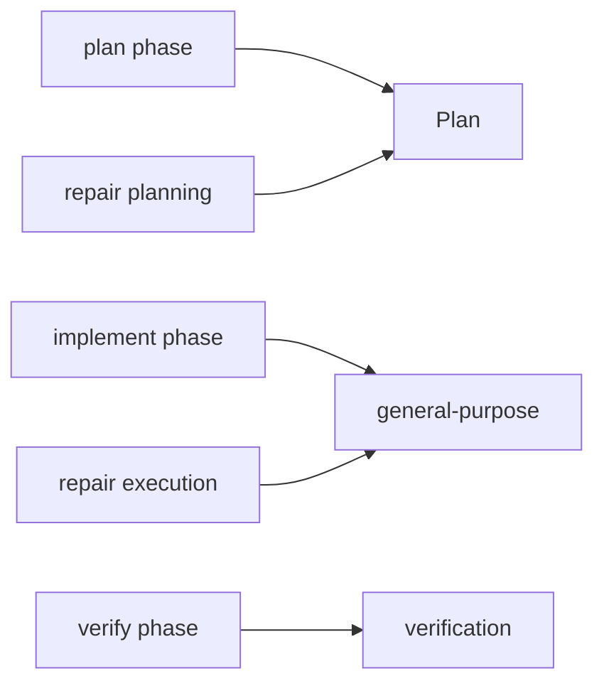

# Mandatory phase → subagent spawning

## Problem

Bootstrap text still says “Recommended lifecycle; you decide when to spawn,” so the main agent often does plan/implement itself. Resume nudges already steer verify/repair/implement, but **there is no Plan nudge** — `LifecycleObserver.needs_plan_spawn` exists and is unused in [`resume_nudges.py`](headless_harness_datagen/controller/resume_nudges.py). Neutral soft continues then keep the loop going without forcing Plan/GP.

Evidence from [`logs/run_test/pipeline/working/trace.jsonl`](headless_harness_datagen/logs/run_test/pipeline/working/trace.jsonl): only `verification` spawns (×3); no Plan / general-purpose.

## Required mapping (always)

| Phase about to begin | Must spawn immediately |
|----------------------|------------------------|
| Initial planning | `Plan` |
| Environment + implementation | `general-purpose` |
| Verification / re-verify | `verification` |
| Repair planning | `Plan` |
| Repair execution | `general-purpose` |

Main agent must **not** write `plan.md` / implement / verify / repair itself — only spawn + relay.



## Changes

### 1. Bootstrap prompt — [`verification/prompts.py`](headless_harness_datagen/verification/prompts.py)

In `build_unified_pipeline_objective` (both verify and skip-verify variants):

- Replace soft “Recommended … you decide when to spawn” with a **MANDATORY PHASE → SUBAGENT** block stating the table above.
- Add explicit FORBIDDEN: do not perform that phase’s work in the main agent; first action when entering a phase is spawn the required `Agent` with the matching `subagent_type`.
- Keep Explore as optional inspection only (not a substitute for Plan/GP/verification).
- Keep existing marker / RUNTIME_CHECK / repair_plan.md rules.

### 2. Resume nudges — [`controller/resume_nudges.py`](headless_harness_datagen/controller/resume_nudges.py)

Insert **highest-priority after rejected-PASS / before repair** (or after repair block when plan not done for initial path):

- When `lifecycle.needs_plan_spawn` → `ResumeNudge(kind="plan", message=...)` that **must** spawn `Plan` to write `plan.md` (do not draft the plan in the main agent).

Priority order becomes:

1. Rejected PASS → re-verify (`verification`)
2. Repair needed, no repair plan → repair planning (`Plan`) — already present
3. Repair needed, plan exists → repair implementation (`general-purpose`) — already present
4. Repair done → verification rerun — already present
5. `needs_plan_spawn` → **new** Plan nudge
6. `needs_env_or_implement_spawn` → implement (`general-purpose`) — already present
7. `needs_verification_spawn` → verification — already present
8. Neutral default

Strengthen `_build_implement_message` and (via wording) repair/verify builders’ opening lines: “MUST spawn … immediately; do not do this work yourself.”

Optional small helper `_build_plan_message` in `resume_nudges.py` (same style as `_build_implement_message`).

### 3. Nudge builders — [`controller/verification_workflow.py`](headless_harness_datagen/controller/verification_workflow.py)

Tighten lead-in copy on `build_verification_*` / `build_repair_*` so each says the required `subagent_type` is mandatory for that phase (spawn first; no main-agent DIY). Keep spawn instruction blocks as-is.

### 4. Tests

- [`tests/test_lifecycle.py`](headless_harness_datagen/tests/test_lifecycle.py): add `test_resume_plan_when_no_plan`; update `test_unified_prompt_delegates_loop_to_chakra` / any “Recommended lifecycle” asserts to the new mandatory wording.
- [`tests/test_phase7_verification.py`](headless_harness_datagen/tests/test_phase7_verification.py) and [`tests/test_supervisor_policy.py`](headless_harness_datagen/tests/test_supervisor_policy.py): assert mandatory phase→subagent text / Plan / general-purpose / verification mapping.
- Resume repair/implement tests: assert “MUST” / “do not … yourself” where useful.

### 5. Docs

One bullet in [`docs/HANDOVER.md`](headless_harness_datagen/docs/HANDOVER.md) under Architecture or Known follow-ups: phase entry always requires the matching subagent; Python nudges include Plan.

Do **not** modify `harness/`.

## Verify

```bash
python tests/test_lifecycle.py
python tests/test_phase7_verification.py
python tests/test_supervisor_policy.py
python -c "import main"
```
