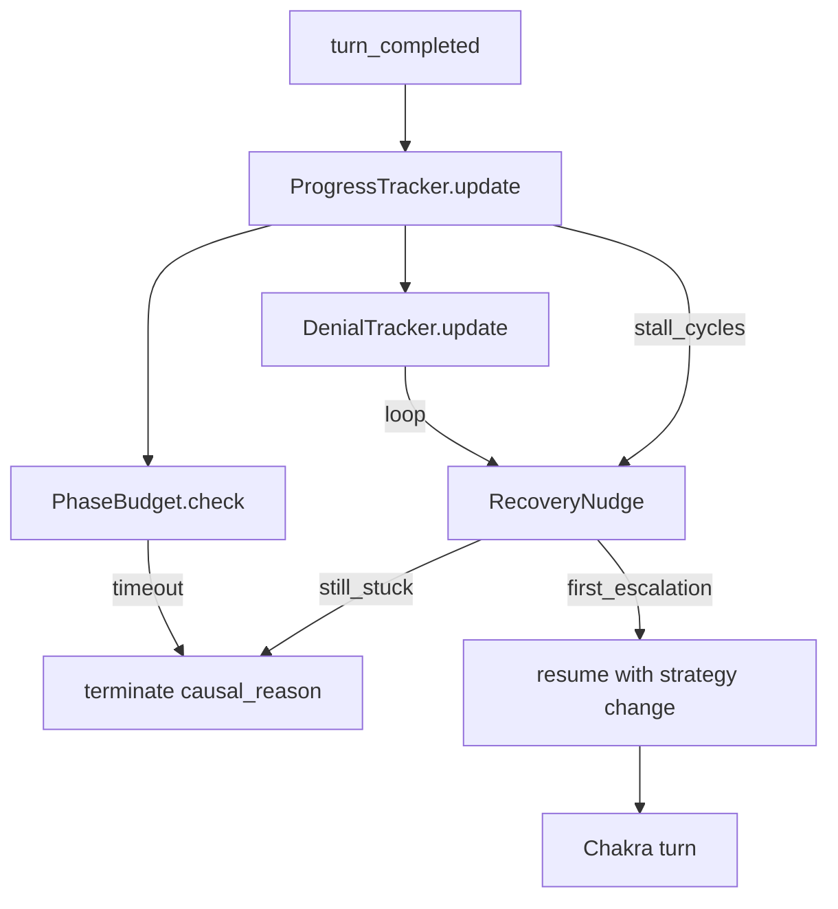

# Progress-aware pipeline controller

Default recovery style: **escalate with stronger phase/recovery nudges, then terminate with a causal reason** (not silent soft-continue until `max_turns`). Python still does not spawn Agents; it steers via resume text + early stop.

## Problem (habit_tracker)

`[SessionHealthMonitor](headless_harness_datagen/controller/session_health.py)` resets “progress” on almost any tool start/complete and turn markers. Explore + denied Bash loops look “active,” so the run dies at `max_turns` instead of `no_forward_progress`.

Offline debugger already has the right signal (`[debugger/progress.py](headless_harness_datagen/debugger/progress.py)`). Port that definition into the live path.

---

## Priority 1 — Progress-aware controller

**Add** `[controller/progress_tracker.py](headless_harness_datagen/controller/progress_tracker.py)` (shared semantics with debugger):

Meaningful progress: new unique `Read` path, any `Edit`/`Write`, `agent_completed`, first spawn of a new `subagent_type`, lifecycle markers, `verification_result`. **Not** progress: denials, repeated identical Bash, soft-continue alone.

Wire into `[conversation_runner.py](headless_harness_datagen/controller/conversation_runner.py)` before each resume:

1. Update tracker from the completed turn’s events (orchestration already observes; feed tool/agent/marker signals).
2. If `consecutive_resume_cycles_without_progress >= stall_cycles` (config, default **5**):
  - First hit → **recovery resume** (Priority 3), log `controller_decision` with `decision=recover`.
  - Second hit still stuck → **terminate** with `termination_reason=no_forward_progress` (and detail: last progress kind, denial top group, current phase).
3. Stop issuing neutral soft-continues while stalled.

Config knobs on `[ConversationConfig](headless_harness_datagen/controller/conversation_config.py)`: `stall_cycles=5`, `max_recovery_attempts=1` (one escalate then stop).

---

## Priority 2 — Phase contracts + budgets

**Add** `[controller/phase_contracts.py](headless_harness_datagen/controller/phase_contracts.py)`:

| Phase          | Entered when               | Complete when                                    | Budget (turns, defaults)                    |
| -------------- | -------------------------- | ------------------------------------------------ | ------------------------------------------- |
| explore        | Explore spawn              | Plan spawn or plan.md / exit explore             | 8                                           |
| plan           | Plan spawn / plan.md       | `plan_done` / Plan complete                      | 6                                           |
| implementation | GP spawn                   | `ENV_STATUS` + `IMPLEMENTATION_STATUS: COMPLETE` | 20                                          |
| verification   | verification spawn         | authoritative PASS or FAIL/PARTIAL recorded      | 10                                          |
| repair         | repair nudge / repair_plan | `REPAIR_STATUS: COMPLETE` then re-verify handoff | existing `max_repair_iterations` + 10 turns |

Track `current_phase` + turns-in-phase on `[LifecycleObserver](headless_harness_datagen/controller/lifecycle.py)` / orchestration.

On budget exceed:

- Prefer a **one-shot phase-timeout nudge** (“finish this phase or emit failure marker”), then
- Terminate with `phase_budget_exceeded:<phase>` if still incomplete.

Do **not** treat Explore as success; lingering Explore without Plan after budget → recovery to Plan (P3) or `stuck_in_explore`.

---

## Priority 3 — Adaptive recovery (nudge-level)

**Add** `[controller/recovery.py](headless_harness_datagen/controller/recovery.py)` selecting a recovery kind from evidence:

| Signal                                                | Recovery resume content                                                                  |
| ----------------------------------------------------- | ---------------------------------------------------------------------------------------- |
| Explore-only / no Plan|GP                             | Force Plan then general-purpose spawn instructions (reuse builders)                      |
| Identical Bash denied ≥ N (default 3) in-turn/session | “Stop repeating denied command; stay under working_directory=`…`; try Read/Glob instead” |
| Out-of-repo denials dominate                          | Remind absolute repo root; forbid `cd` outside                                           |
| Phase budget warning                                  | Finish-or-fail markers for current phase                                                 |

Log `controller_decision` `{decision:recover, kind, reason}`. After `max_recovery_attempts`, terminate causally rather than loop.

Denial tracking can reuse debugger grouping logic (extract a tiny shared helper under `controller/` or import from `debugger.retries` carefully to avoid circular imports — prefer a small `controller/denial_tracker.py`).

---

## Priority 4 — Progress / efficiency metrics (live)

On each resume/terminate and periodically in snapshot, log `pipeline_metrics` (or extend orchestration snapshot):

- `useful_tool_calls` vs `denied_tool_calls`
- `forward_progress_events` count
- `consecutive_resumes_without_progress`
- `turns_in_phase` / `phase_entered_at_seq`
- `phase_transition_latency_seconds` when phase changes

Debugger `[metrics.py](headless_harness_datagen/debugger/metrics.py)` already reads traces — extend to prefer live `pipeline_metrics` events when present so compare stays consistent.

---

## Priority 5 — Causal termination (live)

When stopping for stall/budget/denial-loop, set:

- `termination_reason` ∈ `no_forward_progress` | `stuck_in_explore` | `phase_budget_exceeded:<phase>` | `denial_loop` | existing reasons
- `controller_decision` terminate payload includes `causal_summary` string
- `summary.json` / `run_completed` already carry `termination_reason` — debugger taxonomy already demotes `max_turns`; ensure new reasons map as **primary** Controller/Lifecycle in `[taxonomy.py](headless_harness_datagen/debugger/taxonomy.py)`

Goal: habit_tracker-like runs end as `no_forward_progress` / `stuck_in_explore`, not `max_turns`.

---

## Tests + docs

- `tests/test_progress_tracker.py` — denials don’t count; Edit resets; stall threshold
- `tests/test_phase_budgets.py` — explore budget → warning then terminate reason
- `tests/test_recovery_nudge.py` — explore-only → Plan/GP recovery message; denial loop message
- Extend runner unit test with fake orch/trace: after N no-progress resumes → recover once → terminate causal
- Update `[docs/HANDOVER.md](headless_harness_datagen/docs/HANDOVER.md)` + short section in `[docs/DEBUGGER.md](headless_harness_datagen/docs/DEBUGGER.md)` / architecture note on progress definition alignment

## Explicit non-goals this pass

- No Chakra/`harness/` changes
- Python does not itself spawn Agent tools (nudge-only)
- No web UI
- Do not re-introduce mandatory Plan-before-everything hard blocks that were previously reverted — budgets + recovery nudges only

